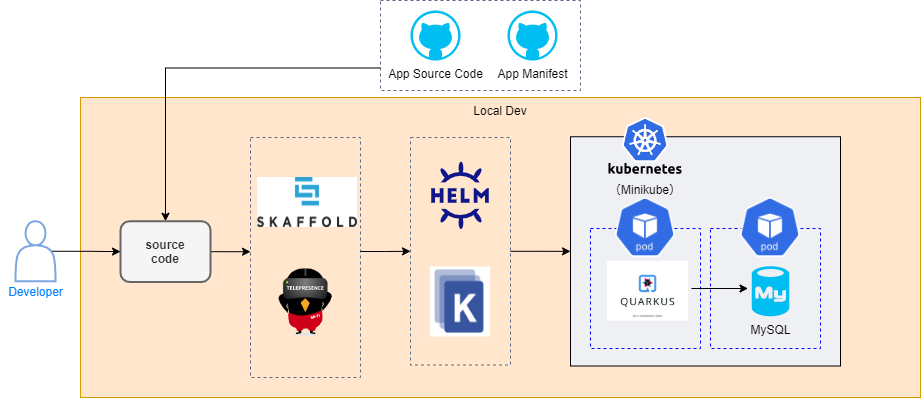

# nautible-app-ms-product project
このドキュメントには商品アプリケーションについて記載する。  
アプリケーション共通の内容については[こちら](https://github.com/nautible/docs/blob/main/referenceapp-architecture/README.md)を参照。
Quarkusアプリケーション共通の内容については[こちら](https://github.com/nautible/docs/blob/main/reference/quarkus/README.md)を参照。

## アプリケーションの主要アーキテクチャ
* [Java11](https://www.oracle.com/java/)
* [Quarkus](https://quarkus.io/)
* [Maven](https://maven.apache.org/)
* REST
* [gRPC](https://grpc.io/)
* [Kubernetes](https://kubernetes.io/)
* [Docker](https://www.docker.com/)
* [AWS](https://aws.amazon.com/)

## Productサービスが利用するAWSリソースとローカル環境での代替
|  開発環境(AWS)  |  ローカル環境  | 備考 |
| ---- | ---- | ---- |
| ECR | - |  |
| RDS | MySQL |  |

## ローカル環境での開発方法
### ローカル開発イメージ図


### 事前準備
* [dockerのインストール](https://docs.docker.com/get-docker/)
* [minikubeのインストール](https://kubernetes.io/ja/docs/tasks/tools/install-minikube/)
* [kubectlのインストール](https://kubernetes.io/ja/docs/tasks/tools/install-kubectl/)（接続先の設定をminikubeにする）
* [skaffoldのインストール](https://skaffold.dev/docs/install/)
* マニフェストファイルの配置
  [nautible-app-ms-product-manifest](https://github.com/nautible/nautible-app-ms-product-manifest)をnautible-app-ms-productプロジェクトと同一階層に配置する(git clone)。

### 実行
- OpenAPI定義参照
  - 例) hello(稼働確認用)
    - http://localhost:8081/products/hello

## サンプルアプリ利用手順

### アプリケーション依存サービスのビルド

```bash
docker build -t nautible-app-ms-product-mysql:latest -f nautible-app-ms-product-build/src/test/docker/database/Dockerfile .
```

### アプリケーション依存サービスの起動

manifestリポジトリでマニフェストを適用する

```bash
kubectl apply -k overlays/(aws|azure)/local-dev/dependencies
```
### skaffoldによるアプリケーション起動

```bash
skaffold dev --profile=(aws|azure) --port-forward
```
※wslなどのLinux環境で実行することを前提としています